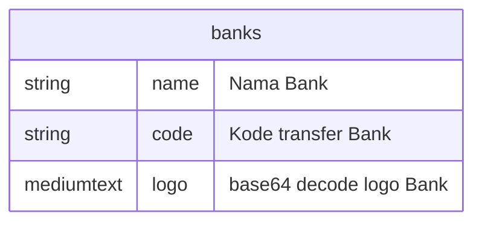

# Daftar Bank Indonesia

Repository ini berisi daftar bank yang terdaftar di Bank Indonesia beserta informasi terkait seperti nama, kode bank, dan logo.

> DISCLAIMER: Data ini diambil dari sumber publik dan mungkin tidak selalu akurat atau terbaru. Silakan verifikasi informasi sebelum menggunakannya untuk tujuan resmi.

> sumber data: [Website ATM Bersama](https://atmbersama.com/banks)

> Validasi data: [Kodebank](https://kodebank.id/)

## Cara Menggunakan
Data disimpan dalam format JSON. Anda dapat mengunduh file `banks.json` dan menggunakannya dalam aplikasi Anda.

### SQL Format
Sebagai alternatif, data juga disimpan dalam format sql dengan format berikut

File logo bank disimpan dalam folder `logos/` dan juga `images`. Anda dapat mengakses logo bank dengan menggunakan nama file yang sesuai dengan kode bank.
